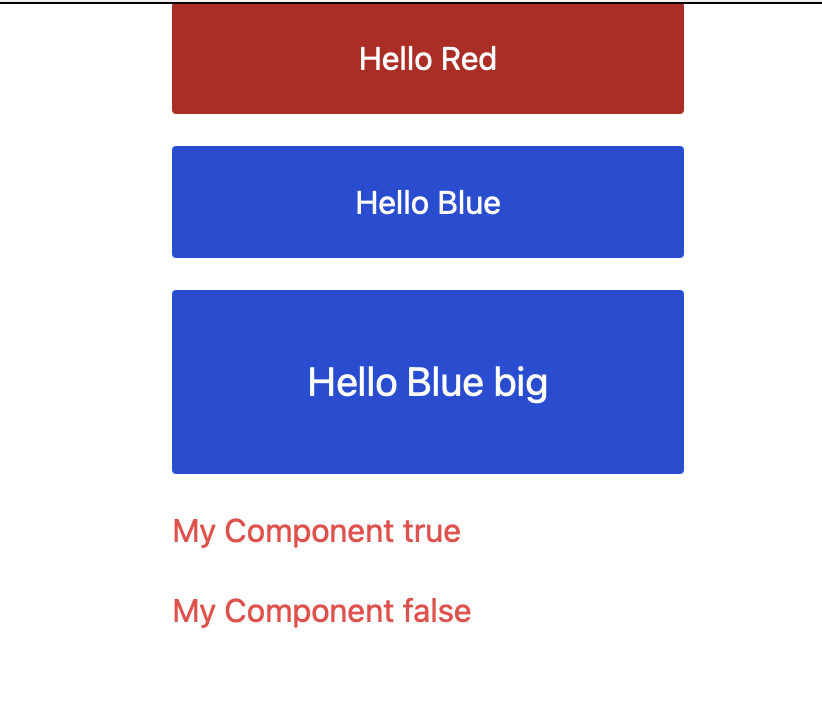

# Examples

This directory shows examples of using `tw-lite` with different bundlers.

Before running the examples you'll want to first install dependencies and
build the `tw-lite` package, since it's linked using npm workspace symlinks.

```sh
bun install
cd packages/tw-lite && bun run build
```

All examples use the same code, and they should all show the same result.


